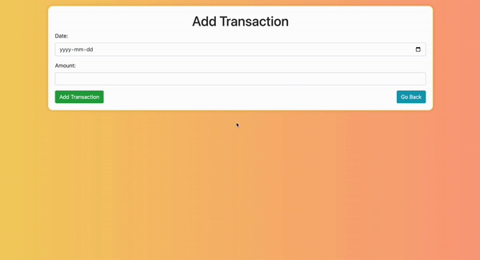

# flask-curd-app

# Overview
CRUD, which stands for Create, Read, Update, Delete, are basic functionalities that any application based on a database must possess. The development of these features requires additional knowledge of handling routes and requests. You also require multiple endpoint HTML interfaces to accommodate different requests. The purpose of this lab, therefore, is to give you some additional practice on the usage of Flask and develop a fully functional, CRUD operation-capable web application.

For this lab, you will develop a financial transaction recording system. 
The system must be capable of 
* Creating a new entry, 
* Reading existing entries, 
* Updating existing entries, and 
* Deleting existing entries.

Objectives
After completing this lab, you will be able to:

* Implement "Create" operation to add transaction entry
* Implement "Read" operation to access the list of transaction entries
* Implement "Update" operation to update the details of a given transaction entry
* Implement "Delete" operation to delete a transaction entry.

* After you complete developing the application, it will function as displayed in the picture below.

The application has three different web pages. The first one displays all the recorded transactions. This page is called Transaction Records and displays all the transactions entries created in the system. This page also gives an option to Edit and Delete the available entries. The option of adding an entry is also available on this page. The second page is Add Transaction which is used when the user chooses to add the entry on the previous page. The user adds the Date and Amount values for the new entry. The third page is Edit Transaction which is user navigated to upon clicking the edit entry option. On this page also, the date and amount are accepted as entries; however, these entries are then reflected against the ID that was being edited.

Note: This platform is not persistent. It is recommended that you keep a copy of your code on your local machines and save changes from time to time. In case you revisit the lab, you will need to recreate the files in this lab environment using the saved copies from your machines.

Let's get started!